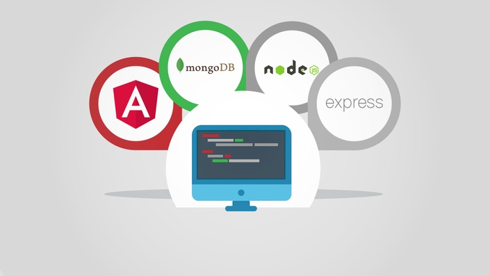

# MeanCourse

Este projeto eu fiz durante o curso Angular & NodeJS - The MEAN Stack Guide da  Academind.

## Funcionalidades

- Autenticação 
- Autorização
- Upload de imagens
- CRUD

<!-- This project was generated with [Angular CLI](https://github.com/angular/angular-cli) version 6.0.1. -->

<!-- ## Development server

Run `ng serve` for a dev server. Navigate to `http://localhost:4200/`. The app will automatically reload if you change any of the source files.

## Code scaffolding

Run `ng generate component component-name` to generate a new component. You can also use `ng generate directive|pipe|service|class|guard|interface|enum|module`.

## Build

Run `ng build` to build the project. The build artifacts will be stored in the `dist/` directory. Use the `--prod` flag for a production build.

## Running unit tests

Run `ng test` to execute the unit tests via [Karma](https://karma-runner.github.io).

## Running end-to-end tests

Run `ng e2e` to execute the end-to-end tests via [Protractor](http://www.protractortest.org/).

## Further help

To get more help on the Angular CLI use `ng help` or go check out the [Angular CLI README](https://github.com/angular/angular-cli/blob/master/README.md). -->

## API

([Veja aqui o repositório da API deste projeto](https://github.com/GuilhermeCCunha/mean-backend)).

## Como usá-lo

1. Baixe este repositório clicando no botão verde **Code** no topo da página e clicando na opção **Download ZIP**.

2. Acesse a pasta raiz do projeto em seu terminal;

3. Execute `npm install` para instalar todas as dependências do projeto (você deve ter [Node.js](https://nodejs.org/en/download/) instalado);

4. Para iniciar a aplicação, execute `npm start` em seu terminal. Ou execute `ng serve` para um servidor de desenvolvimento. Navegue até `http://localhost:4200/`. O aplicativo será recarregado automaticamente se você alterar algum dos arquivos de origem.
